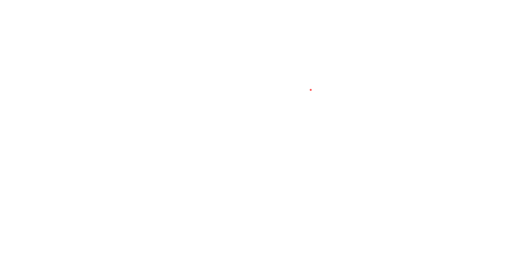

[](https://doi.org/10.5281/zenodo.19138270)

# Reverse Engineering the Dynamics of UFOs

**UFO 動力學之逆向工程**

*— A Physics-Based Assessment of Unidentified Aerial Phenomena*



---

## Author / 作者

**Kris Lai**
- Email: kriss@scallop.io
- ORCID: [0009-0000-2223-4826](https://orcid.org/0009-0000-2223-4826)
- Affiliation: [Scallop Labs](https://www.scallop.io/)

---

## Documents / 文件

| Document | Language | Description |
|----------|----------|-------------|
| [`docs/en/full-text.md`](docs/en/full-text.md) | English | Full assessment in Markdown |
| [`docs/zh-TW/full-text.md`](docs/zh-TW/full-text.md) | 繁體中文 | 完整評估報告 |
| [`docs/en/verification-report.md`](docs/en/verification-report.md) | English | Data verification report |
| [`docs/zh-TW/verification-report.md`](docs/zh-TW/verification-report.md) | 繁體中文 | 資料驗證報告 |
| [`latex/main.tex`](latex/main.tex) | English | REVTeX 4-2 academic paper |

---

## Abstract / 摘要

A systematic physics-based assessment of reported UFO/UAP flight characteristics. Evaluates whether known or theoretically plausible physical mechanisms — including Alcubierre warp metrics, nuclear fusion, dynamical Casimir effect, and metamaterials — could account for the "Five Observables" taxonomy. Concludes that most near-term barriers are **engineering and materials-science constraints**, while controlled energy-to-curvature transduction remains an unresolved physics gap.

以物理學為基礎，系統性評估已報告之 UFO/UAP 飛行特徵。評估已知或理論上合理之物理機制——包括阿乎庫比耶曲速度規、核融合、動態卡西米爾效應及超穎材料——能否解釋「五大可觀測特徵」分類法。結論為，多數近期障礙屬於**工程與材料科學限制**，但可控的能量到曲率轉換仍是未解的物理缺口。

> This is an independent scientific assessment. No classified information was used. All sources are publicly available.

---

## Background / 背景

This work originated from a close reading of ***Imminent: Inside the Pentagon's Hunt for UFOs*** (William Morrow, 2024) by **Luis Elizondo** — the former U.S. Army counterintelligence officer who directed the Pentagon's Advanced Aerospace Threat Identification Program (AATIP) from 2008 to 2017. Elizondo's book is the first insider account from the person who actually ran the U.S. government's modern UFO investigation program. It documents how the "Five Observables" taxonomy was created, the commissioning of 38 classified Defense Intelligence Reference Documents (DIRDs) by world-class physicists, the specific radar and sensor cases that defied conventional explanation, and the internal political battles that led to his resignation in protest.

After reading the book, we realized that the physical claims described — instantaneous acceleration, transmedium travel, absence of sonic booms — are not vague anecdotes but structured, sensor-corroborated observations that can be rigorously evaluated against known physics. This assessment was born from that realization: taking Elizondo's observational framework and the DIRD physics as a starting point, then systematically mapping each claimed observable onto established general relativity, quantum field theory, nuclear physics, and materials science to determine what is physically possible, what is theoretically plausible, and where the true engineering gaps lie.

本作品起源於對 **Luis Elizondo** 所著 ***《Imminent: Inside the Pentagon's Hunt for UFOs》***（William Morrow, 2024）的深入研讀。Elizondo 曾任美國陸軍反情報特別探員，於 2008 至 2017 年間主持五角大廈「先進航太威脅識別計畫」（AATIP），是美國政府現代 UFO 調查計畫的實際負責人。本書是首部由計畫主持人以第一手視角撰寫的內部紀實，記錄了「五大可觀測特徵」分類法的建立過程、38 份由頂尖物理學家撰寫之國防情報參考文件（DIRD）的委託始末、挑戰傳統解釋的具體雷達與感測器案例，以及最終促使他辭職抗議的國防部內部政治角力。

閱讀本書後我們意識到，書中所描述的物理特徵——瞬間加速、跨介質飛行、無音爆——並非模糊的軼事傳聞，而是結構化的、有感測器佐證的觀測紀錄，完全可以用已知物理學進行嚴謹檢驗。本評估即誕生於此認知：以 Elizondo 的觀測框架與 DIRD 物理學為起點，系統性地將每項聲稱之可觀測特徵對應至已建立之廣義相對論、量子場論、核物理學及材料科學，判定何者在物理上可能、何者在理論上合理、以及真正的工程差距究竟在何處。

---

## Sections / 章節概覽

| # | Section | 節標題 | Key Topics |
|---|---------|--------|------------|
| 1 | Introduction & Historical Context | 導論與歷史脈絡 | Terminology (UFO ⊂ UAP); Blue Book → AATIP → AARO; 38 DIRDs |
| 2 | Observable Characteristics | 可觀測特徵 | Five Observables; data quality assessment; geodesic equation; equivalence principle; alternative frameworks |
| 3 | Propulsion Mechanisms | 推進機制 | Alcubierre metric; warp bubble morphology; exotic matter; wormholes |
| 4 | Energy Sources | 能量來源 | DT/DD fusion; NIF ignition; heavy water; vacuum energy |
| 5 | Electromagnetic Signatures | 電磁特徵 | Dynamical Casimir; Unruh; Hawking; THz gap; biological effects |
| 6 | Advanced Materials | 先進材料 | Metamaterials; CNT; graphene; Bi-Mg analysis; QCD bonding |
| 7 | Integrated Model | 整合模型 | Single-mechanism synthesis; materials gap analysis |
| 8 | Intelligence Gaps | 情報缺口 | Research priorities; definitive evidence criteria |
| A–E | Appendices | 附錄 | Glossary; equations; DIRD list; confidence definitions; falsification criteria |

---

## Data & References / 資料與參考文獻

| Directory | Contents | 內容 |
|-----------|----------|------|
| `data/schemas/` | JSON Schema for statistics validation | 資料驗證 Schema |
| `data/statistics/` | Per-section quantitative data (45 data points) | 各節定量資料 |
| `data/timelines/` | UAP investigation history; DIRD catalog (CSV) | 調查歷程時間軸 |
| `data/comparisons/` | Energy density; materials gap analysis (CSV) | 能量密度與材料差距比較 |
| `references/bibliography.json` | Master bibliography (59 sources) | 主參考書目 |
| `references/source-registry.json` | URL verification registry (34 URLs) | URL 驗證登錄 |
| `references/per-section/` | Per-section reference documentation | 各節參考文獻 |

### Source Breakdown / 來源分布

| Type / 類型 | Count | % |
|-------------|-------|---|
| Peer-reviewed / 同儕審查 | 31 | 52.5% |
| Government / 政府文件 | 9 | 15.3% |
| DIRD / 國防情報參考文件 | 12 | 20.3% |
| Books / 學術專書 | 6 | 10.2% |
| Preprints / 預印本 | 1 | 1.7% |

### Key Government Sources / 主要政府來源

- [ODNI Preliminary Assessment (2021)](https://www.dni.gov/files/ODNI/documents/assessments/Prelimary-Assessment-UAP-20210625.pdf)
- [ODNI 2022 Annual Report](https://www.dni.gov/files/ODNI/documents/assessments/Unclassified-2022-Annual-Report-UAP.pdf)
- [AARO Historical Record Vol I (2024)](https://media.defense.gov/2024/Mar/08/2003409233/-1/-1/0/DOPSR-2024-0175-HISTORICAL-RECORD-REPORT-VOLUME-I-2024.PDF)
- [ICD 203 Analytic Standards](https://www.dni.gov/files/documents/ICD/ICD-203.pdf)
- [DIRD Collection (Black Vault FOIA)](https://documents2.theblackvault.com/documents/dia/AAWSAP-DIRDs/)
- [DIRD Master List (FAS)](https://irp.fas.org/dia/aatip-list.pdf)

---

## LaTeX Paper / 學術論文

The assessment is also available as a two-column academic paper formatted with REVTeX 4-2 (APS Physical Review D style):

```bash
cd latex/
pdflatex main.tex && bibtex main && pdflatex main.tex && pdflatex main.tex
```

Compiled PDFs are published through the GitHub Actions `ufo-dynamics-paper` artifact rather than committed to the repository, preventing stale binary snapshots.

已編譯 PDF 由 GitHub Actions 的 `ufo-dynamics-paper` artifact 提供，不再直接提交到 repo，以避免過期的二進位檔案。

---

## Validation / 驗證

```bash
python3 scripts/validate_repository.py
python3 scripts/validate_repository.py --check-urls --enforce-url-status
```

The validation script checks bibliography counts, source-registry metadata, statistics-schema compliance, and optional live HTTP spot checks.

驗證腳本會檢查書目計數、來源註冊 metadata、統計資料 schema 相容性，並可選擇執行即時 HTTP 抽查。

---

## Project Structure / 專案結構

```text
UFO-dynamics-reverse-engineering/
├── docs/
│   ├── en/                          # English documents
│   │   ├── full-text.md
│   │   └── verification-report.md
│   └── zh-TW/                      # Traditional Chinese documents
│       ├── full-text.md
│       ├── transcription.md
│       └── verification-report.md
├── data/
│   ├── schemas/                     # JSON Schema validation
│   ├── statistics/                  # Per-section data (4 JSON files)
│   ├── timelines/                   # Historical events (2 CSVs)
│   └── comparisons/                 # Cross-domain analysis (2 CSVs)
├── references/
│   ├── bibliography.json            # 59 sources
│   ├── source-registry.json         # URL verification
│   └── per-section/                 # 8 reference files
├── latex/
│   ├── main.tex                     # REVTeX 4-2 paper
│   ├── references.bib               # 59 BibTeX entries
│   └── figures/
├── CLAUDE.md
├── CITATION.cff
├── CHANGELOG.md
└── README.md
```

---

## AI Collaboration & Data Verification / AI 協作與資料驗證

This project was produced through a structured collaboration between the human author and multiple AI systems, including **Claude** (Anthropic), **Codex**, and **GPT-5.4**. Claude Opus 4 and Claude Sonnet 4 supported literature synthesis, structure, and translation; Codex and GPT-5.4 assisted repository optimization, validation, metadata consistency checks, and disclosure/reporting refinements. AI contributions included:

本專案是由人類作者與多個 AI 系統進行結構化協作所產出，包括 **Claude**（Anthropic）、**Codex** 與 **GPT-5.4**。其中 Claude Opus 4 與 Claude Sonnet 4 主要協助文獻綜整、結構編排與翻譯；Codex 與 GPT-5.4 則協助 repo 優化、驗證流程、metadata 一致性檢查，以及 AI 揭露與報告修訂。AI 之貢獻包括：

| Contribution / 貢獻 | Description / 說明 |
|---------------------|--------------------|
| Literature synthesis / 文獻綜整 | Cross-referencing 59 sources / 交叉比對 59 筆來源 |
| Equation typesetting / 公式排版 | Markdown + LaTeX (REVTeX 4-2) formatting / 格式化 |
| Structural organization / 結構組織 | 8-section architecture, bilingual parity / 八章節架構、雙語對照 |
| Data infrastructure / 資料基礎設施 | JSON Schema, statistics, timelines, source registry / 驗證架構 |
| Optimization & verification / 優化與驗證 | Repository cleanup, validation hardening, metadata consistency, disclosure updates / repo 整理、驗證補強、metadata 一致性與揭露更新 |
| Translation / 翻譯 | Full Traditional Chinese parallel text / 繁體中文全文翻譯 |

**All scientific judgments, assessments, and conclusions are solely those of the human author.**

**所有科學判斷、評估及結論均為人類作者之獨立意見。**

43 of 45 quantitative data points are independently cross-checked against cited sources; two contested estimates are retained as low-confidence analysis. See the [verification reports](docs/en/verification-report.md) for the current audit details.

45 個定量資料點中有 43 個已對照引用來源完成交叉檢查；另有 2 個具爭議之估計值以低信心分析保留。完整審核詳見[驗證報告](docs/zh-TW/verification-report.md)。

---

## How to Cite / 引用方式

### APA

Lai, K. (2026). *Reverse Engineering the Dynamics of UFOs: A Physics-Based Assessment of Unidentified Aerial Phenomena* (Version 1.2.2). DOI: [10.5281/zenodo.19138270](https://doi.org/10.5281/zenodo.19138270).

### BibTeX

```bibtex
@misc{Lai_UFO_2026,
  title     = {Reverse Engineering the Dynamics of UFOs: A Physics-Based Assessment of Unidentified Aerial Phenomena},
  author    = {Lai, Kris},
  year      = {2026},
  version   = {1.2.2},
  note      = {UNCLASSIFIED --- Open Source Analysis},
  doi       = {10.5281/zenodo.19138270},
  url       = {https://github.com/djchrisssssss/ufo-dynamics-reverse-engineering}
}
```

See also: [CITATION.cff](CITATION.cff)

---

## License / 授權

This work is licensed under [CC BY 4.0](https://creativecommons.org/licenses/by/4.0/).

本著作以 [CC BY 4.0](https://creativecommons.org/licenses/by/4.0/) 授權。
